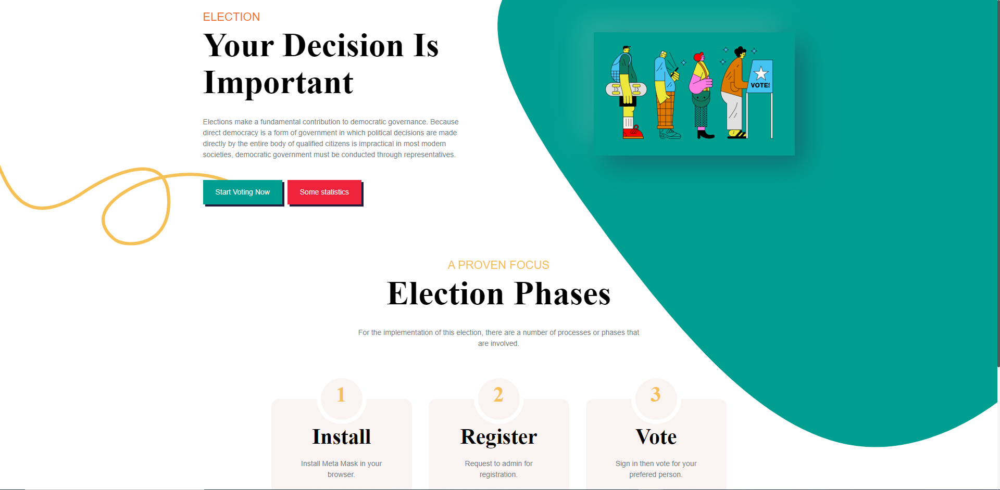
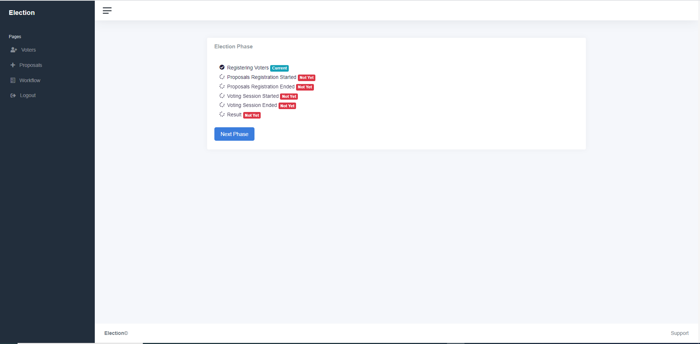
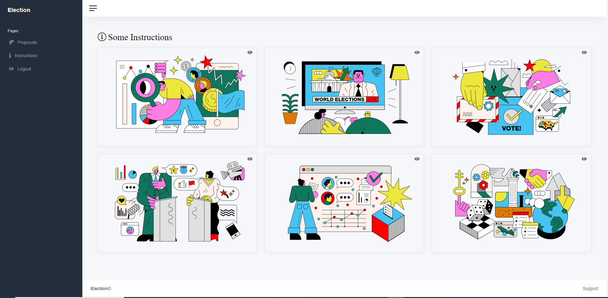
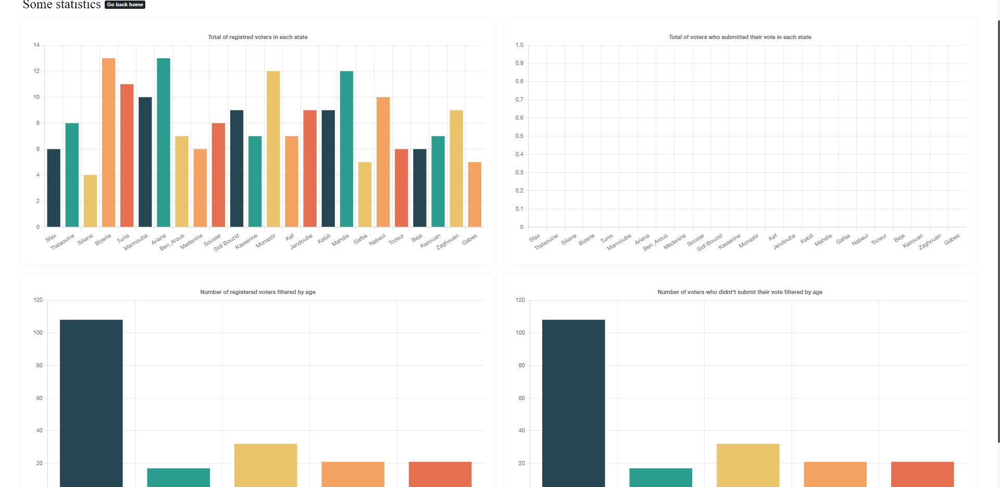
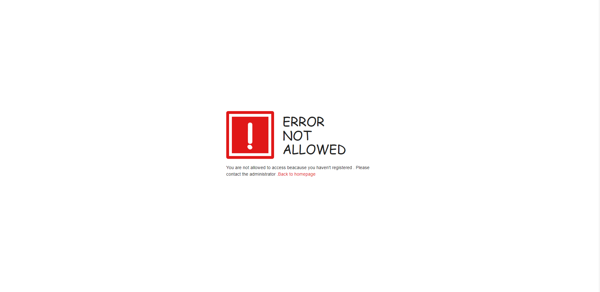

<div id="top"></div>

<br />
<div align="center">
  <a href="#">
    
  </a>

<h3 align="center">Full Stack Dapp <br/>
Election voting dapp using smart contracts</h3>
</div>

<!-- TABLE OF CONTENTS -->
<details>
  <summary>Table of Contents</summary>
  <ol>
    <li>
      <a href="#about-the-project">About The Project</a>
      <ul>
        <li><a href="#built-with">Built With</a></li>
      </ul>
    </li>
    <li>
      <a href="#getting-started">Getting Started</a>
      <ul>
        <li><a href="#prerequisites">Prerequisites</a></li>
        <li><a href="#installation">Installation</a></li>
      </ul>
    </li>
    <li><a href="#usage">Usage</a></li>
    <li><a href="#roadmap">Roadmap</a></li>
    <li><a href="#contributing">Contributing</a></li>
    <li><a href="#license">License</a></li>
    <li><a href="#contact">Contact</a></li>
    <li><a href="#acknowledgments">Acknowledgments</a></li>
  </ol>
</details>

<!-- ABOUT THE PROJECT -->

## About The Project

<a href="#">

</a>
Conducting elections in a traditional way is generally a huge expense & has many inherent flaws, which if not addressed leads to a high trust deficit and unworthy candidates being chosen.

A Centralized process :

- Double (Multiple) Voting.
- Voting for Invalid candidates.
- Voter impersonation is possible.
- Voter identity is not private.
- Tampering with election process is possible.
- Trust deficit as only central authority has access to verify every vote.

Hence, we need to devise a more convenient way for people to vote using technology which enables complete trust and is easily verifiable.

Solution:

- Blockchain enables a trust less, verifiable system on a replicated hyper ledger.
- Build a DAPP (Decentralized Application) to enable voting using smart contracts.

<p align="right">(<a href="#top">back to top</a>)</p>

### Built With

- [Node.js](https://nodejs.org/en/)
- [React.js](https://reactjs.org/)
- [Web3.js](https://web3js.readthedocs.io/en/v1.7.1/)
- [Chart.js](https://www.chartjs.org/)
- [Express](https://expressjs.com/)
- [Redux](https://redux.js.org/)
- [Solidity](https://docs.soliditylang.org/en/v0.8.13/)
- [Truffle](https://trufflesuite.com/)
- [Ganache](https://trufflesuite.com/ganache/index.html)
- [Bootstrap](https://getbootstrap.com/)
- [MetaMask](https://metamask.io/)

<p align="right">(<a href="#top">back to top</a>)</p>

<!-- GETTING STARTED -->

## Getting Started

### Prerequisites

First all of all you need to install some prerequesties by following these steps bellow :

1. Install Git : [https://git-scm.com/](https://git-scm.com/)
2. Install Node.js : [https://nodejs.org/en/](https://nodejs.org/en/)
3. Install Ganache : [https://trufflesuite.com/ganache/](https://trufflesuite.com/ganache/)

### Installation

1. Clone the repo

   ```sh
   git clone https://github.com/sadekmehri/Full-Stack-Dapp.git
   ```

2. Go to font-end folder :

   ```sh
   cd front-end
   ```

3. Install packages :

   ```sh
   npm i
   ```

4. Go to back-end folder :

   ```sh
   cd back-end
   ```

5. Install packages :

   ```sh
   npm i
   ```

6. Enter your Credentials in `.env` file (back-end folder) :

   ```js
   APP_URI = 'ENTER FRONT-END URL'
   TRUFFLE_HTTP_PROVIDER = 'ENTER TRUFFLE URL'
   APP_SECRET = 'ENTER APP SECRET'
   ```

7. Link your truffle project with Ganache :

   ```js
   https://www.youtube.com/watch?v=UnNPv6zEbwc
   ```

8. Import an account provided with Ganache to MetaMask :

   ```js
   https://www.youtube.com/watch?v=lv4HEyiw4EQ
   ```

9. Compile your smart contract by tapping in back-end folder :

   ```js
   npm run dev:compile
   ```

10. Migrate your smart contract by tapping in back-end folder :

    ```js
    npm run dev:migrate
    ```

11. Run unit tests for smart contract by tapping in back-end folder :

    ```js
    npm run dev:test
    ```

12. Run the express server by tapping in back-end folder :

    ```js
    npm run dev
    ```

13. Run the frontend client by tapping in front-end folder :
    ```js
    npm start
    ```

<p align="right">(<a href="#top">back to top</a>)</p>

<!-- USAGE EXAMPLES -->

## Usage

<a href="#">

</a>
<a href="#">

</a>
<a href="#">

</a>
<a href="#">

</a>
<a href="#">

</a>

<p align="right">(<a href="#top">back to top</a>)</p>

<!-- ROADMAP -->

## Roadmap

See the [open issues](https://github.com/sadekmehri/Full-Stack-Dapp/issues) for a full list of proposed features (and known issues).

<p align="right">(<a href="#top">back to top</a>)</p>

<!-- CONTRIBUTING -->

## Contributing

Contributions are what make the open source community such an amazing place to learn, inspire, and create. Any contributions you make are **greatly appreciated**.

If you have a suggestion that would make this better, please fork the repo and create a pull request. You can also simply open an issue with the tag "enhancement".
Don't forget to give the project a star! Thanks again!

1. Fork the Project
2. Create your Feature Branch (`git checkout -b feature/AmazingFeature`)
3. Commit your Changes (`git commit -m 'Add some AmazingFeature'`)
4. Push to the Branch (`git push origin feature/AmazingFeature`)
5. Open a Pull Request

<p align="right">(<a href="#top">back to top</a>)</p>

<!-- LICENSE -->

## License

Distributed under the MIT License. See `LICENSE.txt` for more information.

<p align="right">(<a href="#top">back to top</a>)</p>

<!-- CONTACT -->

## Contact

Sadok Mehri - [linkedin](https://www.linkedin.com/in/sadok-mehri-157889188/) - [Porfolio](https://sadok-mehri-portfolio.000webhostapp.com/)  
<br/>
Badis El Beji - [Email](badisbeji@gmail.com)

<p align="right">(<a href="#top">back to top</a>)</p>

<!-- ACKNOWLEDGMENTS -->
